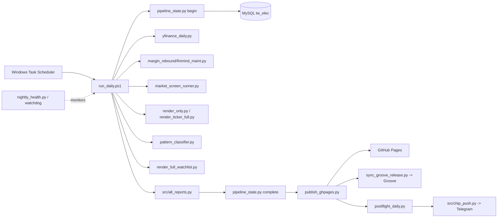

# tw-invest-suite System Design Book

版本：2026-09-21
狀態：Operationally certified for the 2026-09-18 report window; public release remains conditional on security/configuration gates.

## 1. 設計目標

### 1.1 主要目標

- 以已落地的交易日建立可重現的 daily report。
- 同一份 frozen input 同時產生單股頁、市場篩選、籌碼、型態、產業與歷史報告。
- 在發布前驗證資料日期、選股身份、artifact bytes、遠端 SHA 與 Telegram delivery。
- Windows 睡眠/登出後由 Scheduler 自動執行，失敗時可辨識、可重試、不可偽造成功。

### 1.2 非目標

- 不自動下單，不保存券商交易授權。
- 不把缺失值補成零，不用 HTTP 200 代替 freshness proof。
- 不把歷史 scratch scripts 當成部署元件。
- 不宣稱 240 個 warehouse objects 或所有歷史年份都已經完成全量統計驗證。

## 2. 高階架構



## 3. Source-of-truth 邊界

| 層 | Canonical | 用途 |
|---|---|---|
| 原始碼 | `C:\Users\icemo\Projects\tw-invest-suite` | review、版本、測試 |
| Scheduler runtime | `.claude\skills\tw-invest-suite\scripts` | 現行排程 action 的工作目錄與 wrapper |
| DB | MySQL `tw_elec` | canonical dated warehouse |
| public output | GitHub Pages + Groove | 公開報告 bytes |
| AI-Telegram | `D:\CODEX\AI-Telegram` | enrichment、四份 AI reports、Telegram orchestration |
| scratch | `_debug`、底線 py、根目錄 audit files | diagnosis/evidence，不是 production input |

任何 source hash mismatch 都是阻擋條件；不能以「檔案內容看起來一樣」取代 hash receipt。

## 4. 資料流與資料語意

### 4.1 主倉儲

`daily_data2_full(Ticker, Date)` 是 OHLCV、三大法人、融資融券與技術欄位的主表。2026-09-19 audit：3,626,961 rows、1,626 dates、2020-01-02 至 2026-09-18；全表 key/OHLCV null、負值與 `(Ticker, Date)` duplicates 均為 0。

### 4.2 輔助來源

- yfinance：估值、現價、market cap 等 cache refresh。
- FinMind：PE、股利、季報、月營收、margin maintenance、新聞與必要 metadata。
- TWSE/TPEx OpenAPI：官方交易日與市場資料補充。
- FinLab：保留 client 作為歷史/選用元件，非目前 nightly 的主來源。

### 4.3 日期契約

`pipeline_state.py begin` 凍結 `data_date`、`run_id`、expected trading session 與 source hashes。所有後續 stage 必須使用這個 identity。週末 catch-up 只在資料已落地且 execution date 等於 data date 時開啟；未知年份或非交易日不可硬推進。

### 4.4 單位契約

- DB 的 `Volume`、`ForeignNet`、`InvestmentNet`、`DealerNet`、`ThreeNet` 是股；畫面顯示時除以 1000 轉張。
- `MarginBalance`、`ShortBalance` 已是張，不可再除以 1000。
- `valuation.dividend_yield` 是百分比，`market_cap` 是億元。
- 缺失值與真實零值必須可區分。

## 5. Pipeline stage contract

| Stage | Required | 主要入口 | 結果 |
|---|---:|---|---|
| valuation | Yes | `scripts/yfinance_daily.py` | dated valuation cache coverage |
| finmind_maint | Yes on trading full run | `src/margin_rebound/finmind_maint.py` | margin maintenance receipt |
| market_screen | Yes | `scripts/market_screen_runner.py` | run/picks + MD/HTML/prompts |
| finalize_inputs | Yes | `scripts/pipeline_state.py finalize-inputs` | frozen canonical inputs |
| render | Yes | `scripts/render_only.py` -> renderers | ticker HTML + receipt |
| patterns | Yes | `scripts/pattern_classifier.py` | patterns JSON/stats |
| patterns_html | Yes | `scripts/build_patterns_html.py` | patterns HTML |
| margin_scan | Optional | `src/margin_rebound/scan.py` | degraded if unavailable |
| watchlist | Yes | `scripts/render_full_watchlist.py` | watchlist HTML |
| all_reports | Yes | `src/all_reports.py` | 50 report artifacts and 30-date history |

Stage wrapper `scripts/run_stage.py` 以檔案 capture stdout/stderr、sidecar exit code、timeout 與 process tree，避免 PowerShell redirected `ExitCode` 不可靠。

## 6. State machine

```text
ABSENT -> RUNNING -> INPUTS_FINALIZED -> CERTIFIED -> PUBLISHED -> POSTFLIGHT_VERIFIED
             |             |                |             |
             +----------> FAILED <----------+-------------+
```

- 新 run 會立即使舊 success marker 失效。
- `complete` 是 terminal certification；post-certification reporting warning 不會把已認證分析改成成功以外的狀態。
- publisher 只接受同一 UUID/date/source hashes 的 marker。
- watchdog 可以 force-fail 卡住 owner，但不會 mint marker，也不會自動發布。

## 7. 發布設計

1. `publish_ghpages.py --prepare-only` 建立新 staging、驗證每個 artifact SHA，不推送。
2. `--publish` fast-forward 到 GitHub `gh-pages`，驗證 manifest、watchlist、patterns、JSON 與選定 ticker pages。
3. `sync_groove_release.py` 只複製 certified stock paths，保護 Groove music root index/config。
4. `postflight_daily.py --after-publish` 驗證本機與遠端報告狀態。
5. `src/chip_push.py` 讀既有 backend config，使用 date/chat hash ledger 去重；API ok、正整數 message id、回傳 chat 一致才算成功。

Cloudflare/transport 若注入 beacon，stock HTML route 使用 reviewed `no-store,no-transform`；不可刪除內容來製造 hash 相等。

## 8. 可靠性與故障隔離

- 每個 stage 有 bounded timeout、heartbeat 與獨立 log。
- owner process 使用 PID + creation identity 防止 PID reuse。
- PowerShell/child tree 停止必須有上限，不能留下 orphan writer。
- `nightly_health.py` 只處理卡住/失聯 owner，不處理資料語意，也不跳過認證。
- API rate limit 是設計約束；FinMind canonical rate 57/min，不能恢復成無限 parallel。
- all_reports 使用一份 canonical `report_inputs.py` 快照，避免每個報告各自讀到不同日期。

## 9. 安全設計

- token 僅存在 environment、`~/.finmind_token` 或 backend shared config；文件與 public artifacts 不含 secret。
- Telegram sender 缺 credentials 會 fail closed，不會靜默跳過。
- Scheduler 儲存既有 account identity，不把密碼寫入 repo。
- public release 必須移除/替換程式內的本機 DB password defaults，並以 CI secret scan 阻擋再次提交。

## 10. UI/報告設計原則

- 台灣顏色慣例：紅漲、綠跌。
- 單股頁採 tabbed information architecture，URL hash 保留 tab state。
- 法人與觀察重點使用卡片、bar、5/10/20 日聚合，優先讓人能快速判讀。
- 每一份報告都顯示 data date、source/lag、unavailable/warning 狀態。

## 11. 已知限制

- physical sleep-to-wake 尚未在本次認證中強制測試；WakeToRun、StartWhenAvailable 與 wake timers 已讀回。
- 全 warehouse 240 objects/all years 尚未完成全量 correctness certification。
- 來源 API 可能延遲；日期準備閘門會 fail closed。
- scratch legacy scripts 仍可能有非致命 SyntaxWarning；不屬於 scheduled production path。

## 12. 相關決策

完整歷史決策在 [decision-log.md](decision-log.md)，核心包括 MySQL-first、yfinance 估值、FinMind rate limit、disk TTL cache、週末策略、17-tab UI、台灣顏色與 D056 certification gate。
